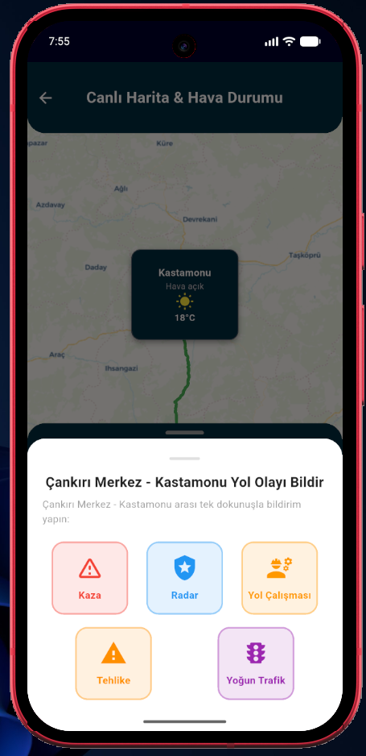

# Yunux RouteMap

Yunux RouteMap, şehirler arası seyahat eden sürücüler için geliştirilmiş bir yol asistanı mobil uygulamasıdır. Güzergah üzerindeki şehirlerin anlık hava durumu bilgilerini gösterir, sürücülerin yol olaylarını (kaza, radar, çalışma, trafik) bildirmesini sağlar ve sürücüler arası yorumlaşma imkanı sunar.

## Ekran Görüntüleri

| Giriş Ekranı | Ana Sayfa | Canlı Harita & Güzergah |
| :---: | :---: | :---: |
|  |  |  |

| Canlı Hava Durumu | Yol Olayı Bildirimi | Sürücü Yorumları | Şehir Seçimi |
| :---: | :---: | :---: | :---: |
|  |  |  |  |

## Özellikler

- **Güzergah ve Mesafe Takibi:** Seçilen kalkış ve varış şehirleri arasındaki mesafeyi, tahmini seyahat süresini ve harita görünümünü listeler.
- **İl ve İlçe Durak Bilgisi:** Güzergah üzerindeki noktaları il ve ilçe bazında gösterir (Örn: Konya (Ilgın)).
- **Anlık Hava Durumu:** Rota üzerindeki şehirlerin güncel hava durumunu ve sıcaklık verilerini çeker.
- **Yol Olayı Bildirimi:** Kaza, radar uyarısı, yol çalışması, tehlikeli yol ve yoğun trafik bildirimleri eklenebilir.
- **Sürücü Yorumları:** Seçilen güzergaha özel yorum paneli ile sürücüler arası iletişim sağlar.
- **Kimlik Doğrulama:** Firebase Auth e-posta/şifre girişi ve misafir modu desteklenir.

## Teknolojiler ve Servisler

- **Framework:** Flutter (Dart)
- **State Management:** BLoC, RxDart
- **Dependency Injection:** GetIt
- **Harita & Geocoding:** flutter_map, OpenStreetMap, CartoDB Voyager, Nominatim Reverse Geocoding API
- **Routing API:** OSRM (Open Source Routing Machine) API
- **Hava Durumu API:** Open-Meteo Forecast API
- **Backend:** Firebase Auth, Cloud Firestore

## Kurulum

1. Projeyi klonlayın:
   ```bash
   git clone https://github.com/yunux/smart_routes.git
   cd smart_routes
   ```

2. Bağımlılıkları yükleyin:
   ```bash
   flutter pub get
   ```

3. Uygulamayı çalıştırın:
   ```bash
   flutter run
   ```
